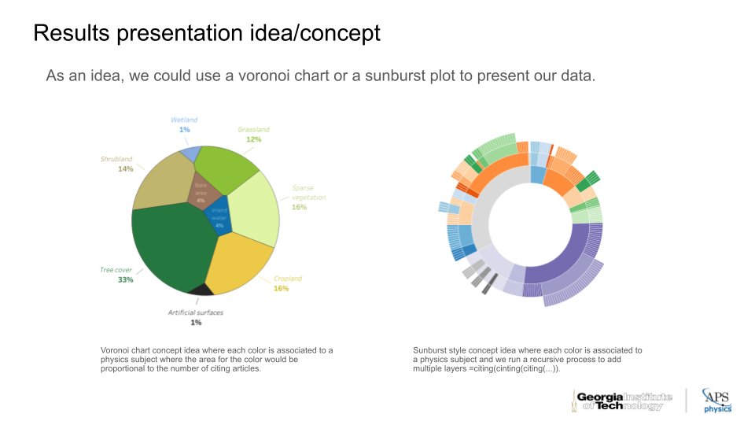

# phiga.tech
phiga.tech is a working name for our group at CSE 6242: Data and Visual Analytics for the masters in analytics from Georgia tech.

# Technology Used

# American Physics Society Cross Citations Network Map

# Group Members
    Rodrigo Costa (costa@gatech.edu)
    Allen Yang (allen.yang@gatech.edu)
    Anthony Sena (asena8@gatech.edu)
    tbd (tbd)
    tbd (tbd)
    tbd (tbd)

